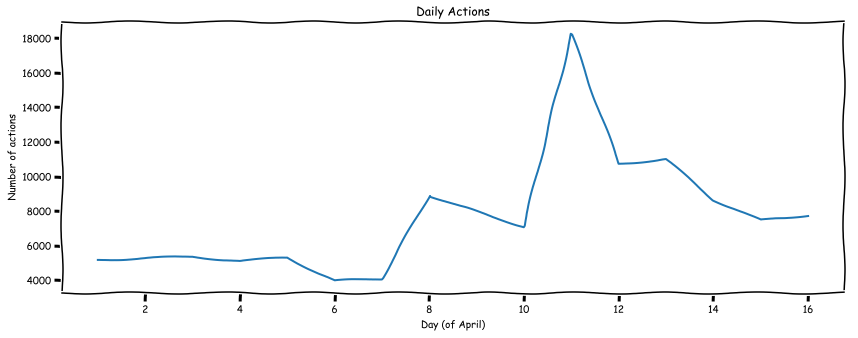

# VK-Data-Analyst-Internship
Test assignment for "VK Data Analyst Internship"
Data and task were taken from vacancy at https://vk.com/jobs

**Задача:**
- Воспроизведите график числа рекламных событий по дням.
- Найдите причину резкого увеличения количества рекламных событий и объясните, что произошло.
- Предложите способ, который помог бы автоматически детектировать аномальные изменения метрик на графиках рекламной статистики. Иными словами, предложите алгоритм, который каждое утро анализирует данные за прошедшие сутки, и, если они сильно выбиваются из общего тренда, отправляет аналитику уведомление: на этом графике есть проблема за вчерашний день. Подумайте, как сделать детектор, который проверяет на аномалии каждый час, каждые пять минут в графике? Предложите вариант кода, который решает эту задачу. Реализовывать логику нотификации не нужно, только поиск аномального дня, часа, пятиминутки в данных рекламной статистики.

**Описание данных:**
- **time** — время взаимодействия пользователя с рекламой в формате UnixTime;
- **event** — тип взаимодействия (click — клик на объявление, view — показ объявления, report — жалоба на объявление);
- **ad_cost_type** — тип трат рекламного объявления (CPM — траты за 1000 показов, CPC — траты за клик);
- **has_video** — наличие видео в объявлении (0 — нет, 1 — есть);
- **agency_union_id** — id рекламного агентства (если рекламный кабинет принадлежит физическому лицу, то ячейка будет заполнена значением 'no_agency');
- **client_union_id** — id рекламного клиента;
- **campaign_union_id** — id рекламной кампании;
- **ad_id** — id рекламного объявления;
- **platform** — платформа, с которой пользователь взаимодействовал с рекламой (web — веб-версия, mvk — мобильная - версия, iphone — IOS-приложение, android — Android-приложение, wphone — Windows Phone-приложение).
